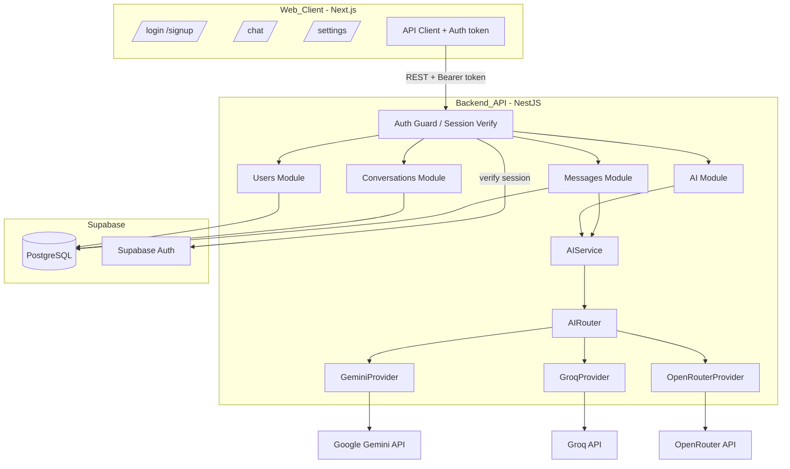

# Design Document

## Overview

VICTOR V1 is a responsive web application composed of three independently deployable parts:

- **Web_Client** — a Next.js (React, TypeScript, Tailwind) application hosting `/login`, `/signup`, `/chat`, and `/settings`.
- **Backend_API** — a NestJS (TypeScript) REST API that owns authentication verification, conversation/message persistence, and AI orchestration.
- **Database** — Supabase PostgreSQL storing profiles, settings, conversations, and messages, with `pgvector` installed for future use but unused in V1.

The frontend never talks to AI providers. The data flow is:

```
Web_Client → Backend_API → AI_Service → AI_Router → AI_Provider (Gemini | Groq | OpenRouter)
```

All AI provider credentials live in backend environment variables. Every persisted record is scoped to an `Authenticated_User_Id` derived from a verified Supabase session, never from the request body.

This design covers V1 only. The module boundaries (auth, users, ai, conversations, messages) are chosen so future modules (tasks, memory, finance, etc.) can be added without rework.

## Architecture



### Key architectural decisions

- **NestJS modules mirror domains** (`auth`, `users`, `ai`, `conversations`, `messages`) to keep separation of concerns and make future modules additive.
- **Auth via Supabase Auth**: the Backend_API verifies the Supabase JWT on each request through a global guard and derives `Authenticated_User_Id` from the verified token. Rationale: avoids re-implementing auth, and keeps user IDs trustworthy.
- **AI abstraction is a stable seam**: `AIService` is the only backend facade; `AIRouter` owns provider selection and fallback; each provider implements a common `AIProvider` interface. Rationale: providers stay replaceable and the frontend never couples to a provider.
- **Streaming via Server-Sent Events (SSE)**: the chat send endpoint streams chunks over `text/event-stream`. Rationale: simplest one-way streaming that works cleanly through Vercel/Next and NestJS.
- **Ownership checks centralized**: a reusable ownership check in conversation/message services enforces that records belong to the `Authenticated_User_Id` before any read or mutation.

## Components and Interfaces

### Backend modules

**AuthModule / Guard**
- `SupabaseAuthGuard` — verifies the bearer token, attaches `Authenticated_User_Id` to the request context, rejects missing/invalid tokens with 401.

**UsersModule**
- `UsersService` — `getProfile(userId)`, `getSettings(userId)`, `updateSettings(userId, dto)`.
- Endpoints: `GET /users/me`, `GET /users/me/settings`, `PATCH /users/me/settings`.

**ConversationsModule**
- `ConversationsService` — `create(userId, dto)`, `list(userId)`, `getOwned(userId, conversationId)`, `delete(userId, conversationId)`.
- Endpoints: `POST /conversations`, `GET /conversations`, `GET /conversations/:id`, `DELETE /conversations/:id`.

**MessagesModule**
- `MessagesService` — `listForConversation(userId, conversationId)`, `appendUserMessage(userId, conversationId, content)`, `appendAssistantMessage(conversationId, content)`, `sendAndStream(userId, conversationId, content)`, `regenerate(userId, conversationId, messageId)`.
- Endpoints: `GET /conversations/:id/messages`, `POST /conversations/:id/messages` (SSE stream), `POST /conversations/:id/messages/:messageId/regenerate` (SSE stream).

**AIModule**
- `AIService` — `generate(request): Promise<AIResult>`, `stream(request): AsyncIterable<AIChunk>`.
- `AIRouter` — `resolveProviderOrder(settings)`, `generate(request)`, `stream(request)` with fallback.
- `AIProvider` interface — `generate(request)`, `stream(request)`, `getAvailableModels()`.
- `GeminiProvider`, `GroqProvider`, `OpenRouterProvider`.
- `AIRequestCodec` — `encode(request): string`, `decode(payload: string): AIRequest` used for provider payload construction/logging.

### AIProvider interface (TypeScript)

```typescript
interface AIRequest {
  model: string;
  messages: { role: 'user' | 'assistant' | 'system'; content: string }[];
  temperature?: number;
}

interface AIResult {
  content: string;
  provider: string;
  model: string;
}

type AIChunk = { type: 'chunk'; content: string } | { type: 'error'; message: string };

interface AIProvider {
  readonly name: 'gemini' | 'groq' | 'openrouter';
  generate(request: AIRequest): Promise<AIResult>;
  stream(request: AIRequest): AsyncIterable<AIChunk>;
  getAvailableModels(): Promise<string[]>;
}
```

### Frontend components

- `AuthPages` (`/login`, `/signup`) — forms wired to Supabase auth.
- `ChatPage` (`/chat`) — `ConversationSidebar`, `MessageList`, `MessageItem` (role indicator, copy, regenerate controls), `MessageInput`, loading and error states, SSE consumption.
- `SettingsPage` (`/settings`) — provider/model selection form.
- `apiClient` — attaches the session token, never holds provider keys.

## Data Models

```typescript
// profiles (1:1 with Supabase auth user)
interface Profile {
  id: string;            // Authenticated_User_Id (Supabase auth uid)
  email: string;
  displayName: string | null;
  createdAt: string;
}

// user_settings
interface UserSettings {
  userId: string;        // FK -> profiles.id
  provider: 'gemini' | 'groq' | 'openrouter';
  model: string;
  updatedAt: string;
}

// conversations
interface Conversation {
  id: string;
  userId: string;        // FK -> profiles.id (ownership)
  title: string;
  createdAt: string;
  updatedAt: string;
}

// messages
interface Message {
  id: string;
  conversationId: string; // FK -> conversations.id
  role: 'user' | 'assistant';
  content: string;
  createdAt: string;      // ordering key
}
```

Constraints:
- `conversations.userId` and `messages.conversationId` are foreign keys; deleting a conversation cascades to its messages.
- Supported `(provider, model)` pairs are validated against a backend allow-list.
- Indexes on `conversations.userId` and `messages.conversationId, createdAt` support ownership-scoped, ordered reads.

## Correctness Properties

*A property is a characteristic or behavior that should hold true across all valid executions of a system-essentially, a formal statement about what the system should do. Properties serve as the bridge between human-readable specifications and machine-verifiable correctness guarantees.*

The following properties are derived from the acceptance criteria prework. Structural/architectural criteria (5.1, 5.2, 5.4) and the specific example/edge criteria (1.1, 1.2, 1.3, 7.4, 8.1, 8.5) are covered by unit/integration tests rather than properties. Redundant criteria were consolidated: 2.4 folds into Property 3 (settings round trip); 3.3, 3.5, and 4.4 fold into Property 6 (ownership enforcement); 7.1 folds into Property 13 (stream reassembly); and 6.2/6.3/6.4 combine into Property 11 (fallback).

### Property 1: Protected endpoints reject requests without a valid session

*For any* protected endpoint and any request that lacks a valid session token, the Backend_API rejects the request with an unauthorized error.
**Validates: Requirements 1.4**

### Property 2: Session-derived user id overrides request body

*For any* verified session and any request body containing an arbitrary user identifier field, the effective user id used by the Backend_API equals the session-derived Authenticated_User_Id.
**Validates: Requirements 1.5**

### Property 3: Settings round trip

*For any* supported (provider, model) pair, updating a user's settings to that pair and then reading the settings returns the same pair.
**Validates: Requirements 2.2, 2.4**

### Property 4: Unsupported settings rejected

*For any* (provider, model) pair not present in the backend allow-list, updating settings is rejected with a validation error and the previously persisted settings remain unchanged.
**Validates: Requirements 2.3**

### Property 5: Created conversation is owned by its creator

*For any* authenticated user, creating a conversation persists a conversation whose userId equals the creator's Authenticated_User_Id.
**Validates: Requirements 3.1**

### Property 6: Ownership enforcement on access and mutation

*For any* conversation not owned by the caller, any attempt to read the conversation, read its messages, or delete it is rejected with a forbidden error and produces no change to stored state.
**Validates: Requirements 3.3, 3.5, 4.4**

### Property 7: List returns exactly the caller's conversations

*For any* set of conversations distributed across multiple users, listing conversations for a user returns exactly the conversations whose userId equals that user's Authenticated_User_Id.
**Validates: Requirements 3.2**

### Property 8: Delete cascades to messages

*For any* conversation owned by the caller with any set of messages, deleting the conversation removes the conversation and every message belonging to it.
**Validates: Requirements 3.4**

### Property 9: Messages persist with correct role and content

*For any* content sent to an owned conversation, a user-role message with that content is persisted, and *for any* assistant reply produced by the AI_Service, an assistant-role message with that reply content is persisted.
**Validates: Requirements 4.1, 4.2**

### Property 10: Messages are returned in ascending creation order

*For any* set of messages inserted into a conversation in any order, listing that conversation's messages returns them ordered by creation time in ascending order.
**Validates: Requirements 4.3**

### Property 11: AI request payload round trip

*For any* valid AI request, encoding the request to its provider payload and then decoding it yields a request equivalent to the original.
**Validates: Requirements 5.3**

### Property 12: Responses exclude provider credentials

*For any* response returned by the Backend_API to the Web_Client, the response contains no AI_Provider credential values.
**Validates: Requirements 5.5**

### Property 13: Router selects the configured provider and model

*For any* user settings specifying a supported provider and model, the AI_Router selects that provider and model as the primary choice for the request.
**Validates: Requirements 6.1**

### Property 14: Bounded ordered provider fallback

*For any* pattern of provider outcomes, the AI_Router attempts the configured providers in order, invoking each provider at most once, stopping at the first success; if every provider fails, the router returns exactly one error result.
**Validates: Requirements 6.2, 6.3, 6.4**

### Property 15: Streaming chunks reassemble to persisted content

*For any* assistant reply, concatenating the delivered Streaming_Response chunks in delivery order produces content equal to the persisted assistant message content.
**Validates: Requirements 7.1, 7.2**

### Property 16: Loading state during streaming

*For any* in-progress Streaming_Response, the Web_Client displays a loading state for the pending assistant message.
**Validates: Requirements 7.3**

### Property 17: Rendered message shows content and matching role indicator

*For any* message, the Web_Client rendering contains the message content and a role indicator that matches the message role.
**Validates: Requirements 8.2**

### Property 18: Copy places assistant content on the clipboard

*For any* assistant message, activating the copy control writes exactly that message's content to the clipboard.
**Validates: Requirements 8.3**

### Property 19: Regenerate targets the preceding user message

*For any* assistant message in a conversation, activating regenerate requests a new reply for the user message that immediately precedes it in the conversation.
**Validates: Requirements 8.4**

### Property 20: Invalid request bodies persist nothing

*For any* request body that fails schema validation, the Backend_API rejects the request with a validation error and persists no record from that request.
**Validates: Requirements 9.1**

### Property 21: Requests beyond the rate limit are rejected

*For any* sequence of requests from one Authenticated_User_Id that exceeds the configured Rate_Limit for a rate-limited endpoint, the Backend_API rejects the excess requests with a too-many-requests error.
**Validates: Requirements 9.2**

### Property 22: Unexpected errors hide internals and are logged

*For any* unexpected error handled by the Backend_API, the returned response excludes internal stack details and a log entry is recorded for the error.
**Validates: Requirements 9.3**

## Error Handling

- **Centralized exception filter**: a global NestJS exception filter maps errors to consistent JSON shapes `{ error: { code, message } }`, strips stack traces from client responses, and logs full details server-side (Property 22).
- **Auth errors**: missing/invalid token → 401; ownership violation → 403 (Property 1, Property 6).
- **Validation errors**: DTO validation failures via `class-validator` → 400 with field messages, no persistence (Property 20).
- **Rate limiting**: `@nestjs/throttler` per-user on AI/message endpoints → 429 when exceeded (Property 21).
- **AI failures**: provider errors and rate limits are caught by the AI_Router; after all providers fail, a single `AIUnavailableError` surfaces as 502 and, mid-stream, an `{ type: 'error' }` chunk is emitted so the client shows an error state (Requirement 7.4, Property 14).
- **Logging**: structured logs (NestJS `Logger`) for auth verification failures, provider fallbacks, and unexpected errors.

## Testing Strategy

VICTOR V1 uses a dual approach: unit tests for concrete examples/edge cases and property-based tests for universal properties. Both are required and complementary.

### Property-based testing

- **Library**: `fast-check` (with Jest) for both backend (NestJS) and frontend (React Testing Library) property tests. Property-based testing is not implemented from scratch.
- **Iterations**: each property-based test runs a minimum of 100 iterations.
- **Mapping**: each correctness property (1–22) is implemented by exactly one property-based test.
- **Tagging**: each property-based test is tagged with a comment in the exact format `**Feature: victor-v1, Property {number}: {property_text}**`.
- **Generators**: smart generators constrain inputs to valid domains — e.g. supported vs unsupported (provider, model) pairs from/against the allow-list, arbitrary message orderings, arbitrary provider-outcome patterns for fallback, and arbitrary request bodies (valid and invalid) for validation. Ownership tests generate multiple users and cross-user record sets.
- **Isolation for data-layer properties**: repository/service properties run against a test database (or an in-memory repository implementing the same interface) so no mocks fake the behavior under test.

### Unit testing

Unit tests cover the example/edge criteria and integration points not expressed as properties:
- Signup happy path and duplicate-email conflict (1.1, 1.2), login session establishment (1.3).
- AIService/AIProvider interface conformance (5.1, 5.2).
- Streaming error state rendering (7.4).
- Chat route renders sidebar/message list/input (8.1) and mobile collapsible sidebar at the breakpoint (8.5).
- AIRouter provider-order resolution edge cases and codec edge inputs.

### Verification gates

Before a task is considered complete: TypeScript type checks, lint, unit + property tests, and a production build all pass.
